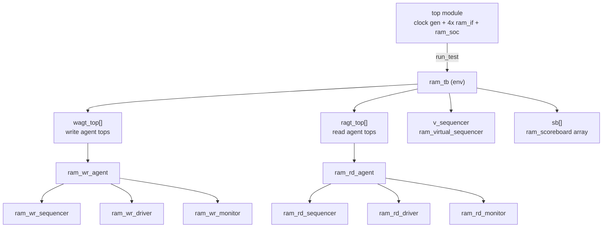
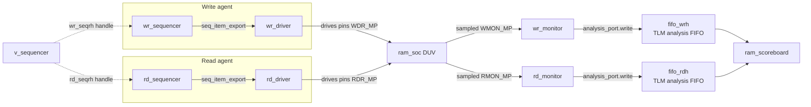
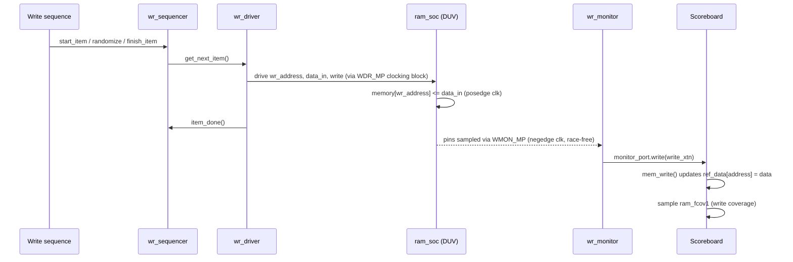
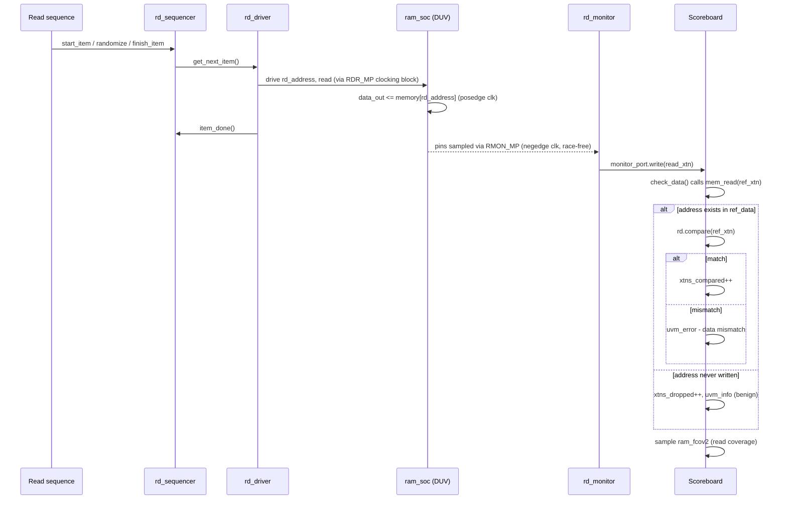

# RAM SoC — UVM Verification Environment

A config-driven, multi-instance **UVM (Universal Verification Methodology)** testbench for a 4-bank, 4096-deep, 64-bit-wide RAM SoC, with independent write/read agents, virtual-sequence-based cross-agent coordination, a reference-model scoreboard, and functional coverage closure.

---

## 1. Project Summary

- **DUT**: A banked RAM (`ram_4096`) built from four `1024 x 64` memory banks (`dual_mem`), address-decoded so that **read and write can hit two different banks in the same clock cycle** with zero contention. Wrapped as `ram_chip` and instantiated 4x inside `ram_soc` to represent a multi-chip SoC.
- **Verification methodology**: Full UVM, with **two independent agents** (write agent, read agent) since read and write are functionally decoupled at the DUT boundary.
- **Stimulus**: Constrained-random sequence items (`write_xtn`, `read_xtn`) with weighted good/bad address distribution (`dist` constraint) to stress-test both legal traffic and boundary/illegal conditions.
- **Scalability**: Environment is fully **config-driven** via `uvm_config_db` — a single `no_of_duts` parameter in `ram_env_config` scales the entire environment (agents, scoreboards, virtual sequencer arrays) to N parallel DUT instances with zero code duplication.
- **Cross-instance coordination**: A **virtual sequencer** + **virtual sequences** orchestrate synchronized write/read traffic across all DUT instances from one central sequence.
- **Checking**: A **scoreboard** with an associative-array reference model — every observed write updates the golden model, every observed read is compared against it via `uvm_analysis_port` → `uvm_tlm_analysis_fifo` transaction-level communication.
- **Coverage**: Functional covergroups cross-binning address ranges against data ranges, separately for read and write traffic, to quantitatively confirm the randomized stimulus actually exercised the full address/data space in combination — not just independently.

--- EDAPLAY GROUND LINK -------
https://edaplayground.com/x/gT2D

## 2. DUT Architecture

| Module | Role |
|---|---|
| `dual_mem` | Base memory bank — `1024 x 64`. Independent synchronous write port (`mem_en`+`write`) and read port (`op_en`+`read`) on the same clock. |
| `mem_dec` | 2-to-4 address decoder — turns the top 2 address bits into one-hot bank-select lines. |
| `ram_4096` | Top-level memory — uses **two separate decoders**, one for `wr_address`, one for `rd_address`, so read and write can independently select *different* banks in the same cycle. Bottom 10 bits go to all 4 banks as the in-bank address. |
| `ram_chip` | Thin wrapper connecting the `ram_if` SystemVerilog interface to `ram_4096`'s individual ports. |
| `ram_soc` | Instantiates 4x `ram_chip` — the actual multi-chip DUT the testbench drives. |

**Key design decision**: dual independent decoders (read-address decoder + write-address decoder) instead of one shared decoder — this is what enables true concurrent read/write across banks, similar to bank interleaving in real memory controllers.

---

## 3. UVM Testbench Architecture — Build Hierarchy

This shows **who creates whom** during `build_phase`, top-down through the component tree:



**Notes:**
- `wagt_top[]`, `ragt_top[]`, and `sb[]` are all dynamically sized to `m_cfg.no_of_duts` — this is the array-sizing pattern that makes the whole environment scale.
- `ram_wr_driver`/`ram_wr_sequencer` are only created `if (m_cfg.is_active == UVM_ACTIVE)` — the monitor is always created regardless, supporting passive-mode reuse.

---

## 4. TLM Connection Diagram (`connect_phase`)

This is the wiring that happens **after** build — connecting driver↔sequencer, virtual sequencer↔real sequencers, and monitor↔scoreboard:



---

## 5. Signal Flow — Write Transaction

End-to-end timing of one write transaction, from sequence to memory to reference model:



## 6. Signal Flow — Read Transaction + Scoreboard Check

This is where the actual pass/fail checking happens:



---

## 7. Component Reference Table

| Component | Type | Responsibility |
|---|---|---|
| `write_xtn` / `read_xtn` | `uvm_sequence_item` | Randomized transaction — address, data, write/read control, `xtn_type` (good/bad), `xtn_delay` |
| `ram_wbase_seq` / `ram_ten_wr_xtns` / `ram_odd_wr_xtns` / `ram_even_wr_xtns` | `uvm_sequence` | Concrete write traffic patterns (fixed address, sequential, odd-only, even-only) |
| `ram_wr_sequencer` | `uvm_sequencer` | Arbitrates and queues write transactions for the driver |
| `ram_wr_driver` | `uvm_driver` | Pulls transactions, drives DUT pins via the `WDR_MP` clocking block |
| `ram_wr_monitor` | `uvm_monitor` | Passively samples DUT pins via `WMON_MP`, broadcasts observed transactions over `uvm_analysis_port` |
| `ram_wr_agent` | `uvm_agent` | Bundles sequencer + driver + monitor; active/passive controlled by `m_cfg.is_active` |
| `ram_wr_agent_config` | `uvm_object` | Per-agent config — virtual interface handle, active/passive mode, transaction counters |
| `ram_wr_agt_top` | `uvm_env` | Top-level wrapper per DUT instance, one per array entry |
| `ram_vbase_seq` / `ram_ten_vseq` / `ram_even_vseq` / `ram_odd_vseq` | Virtual `uvm_sequence` | Orchestrates write+read sequences across **all** DUT instances from one place |
| `ram_virtual_sequencer` | `uvm_sequencer` | Holds handles to every real write/read sequencer; the target virtual sequences `.start()` against |
| `ram_scoreboard` | `uvm_scoreboard` | Reference-model checker — `ref_data[]` associative array, `mem_write()`, `mem_read()`, `check_data()`, functional coverage |
| `ram_env_config` | `uvm_object` | Environment-level config — `no_of_duts`, per-instance agent config arrays, feature enables |
| `ram_tb` | `uvm_env` | Top-level environment — builds and connects everything above |
| `ram_if` | `interface` | DUT pins + 4 clocking blocks (`wdr_cb`, `rdr_cb`, `wmon_cb`, `rmon_cb`) + 5 modports |

---

## 8. Repository Structure

```
├── ram_if.sv                    # Interface + clocking blocks + modports
├── dual_mem.v                   # Memory bank RTL
├── mem_dec.v                    # Address decoder RTL
├── ram_4096.v                   # Top-level banked memory RTL
├── ram_chip.sv                  # DUV wrapper
├── ram_soc.sv                   # Multi-chip DUV
│
├── write_xtn.sv                 # Write sequence item
├── read_xtn.sv                  # Read sequence item
├── ram_wr_seqs.sv                # Write sequences (base + concrete patterns)
├── ram_rd_seqs.sv                # Read sequences
├── ram_wr_sequencer.sv
├── ram_rd_sequencer.sv
├── ram_wr_driver.sv
├── ram_rd_driver.sv
├── ram_wr_monitor.sv
├── ram_rd_monitor.sv
├── ram_wr_agent_config.sv
├── ram_rd_agent_config.sv
├── ram_wr_agent.sv
├── ram_rd_agent.sv
├── ram_wr_agt_top.sv
├── ram_rd_agt_top.sv
│
├── ram_scoreboard.sv             # Reference model + checker + coverage
├── ram_vseqs.sv                  # Virtual base + concrete virtual sequences
├── ram_virtual_sequencer.sv
├── ram_env_config.sv
├── ram_tb.sv                     # Top-level UVM environment
│
└── top.sv                        # Testbench top — clock, interfaces, DUV, run_test()
```

---

## 9. Key Design Highlights

- **Concurrent bank access** — independent read/write decoders let different banks be accessed simultaneously with zero arbitration overhead.
- **Race-free clocking** — driver clocking blocks sample/drive on `posedge`, monitor clocking blocks sample on `negedge`, eliminating drive/sample races without manual delays.
- **Config-driven scalability** — one `no_of_duts` parameter scales agents, scoreboards, and virtual sequencer arrays with zero code duplication.
- **Passive/active agent split** — monitors are always built; drivers/sequencers only exist when `is_active == UVM_ACTIVE`, supporting reuse in passive-only configurations.
- **Reference-model scoreboarding** — an associative array (`ref_data[]`) provides `.exists()` for free, cleanly separating "address never written" from "real data mismatch."
- **Cross-coverage, not independent coverage** — address bins are crossed with data bins so coverage holes reveal missing *combinations*, not just missing individual ranges.


## EDA PLAYGROUND LINK IS 
https://edaplayground.com/x/gT2D
